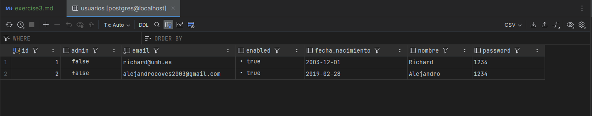
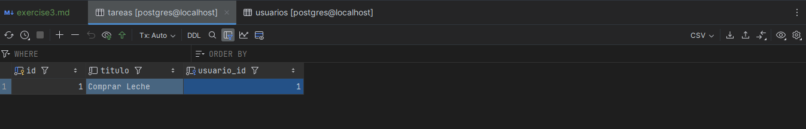
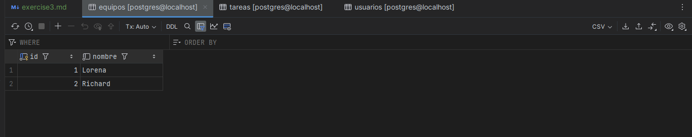
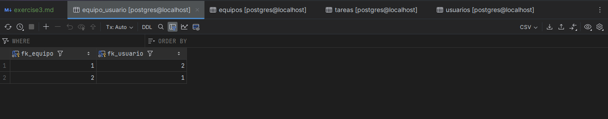

# Exercise 3 Documentation

## Team Membership and Management Functionality (User Stories 008, 009 and 010)

This document summarizes the technical implementation of the features developed in user stories 009 (mandatory) and 010 (optional) for the ToDo List application. These stories focused on managing team membership, administrative actions like renaming and deleting teams, and allowing users to create new teams. The final implementation was built using Spring Boot, JPA, Thymeleaf, and TDD (Test-Driven Development).

---

## 1. PostgreSQL Database Screenshot

A screenshot of the database structure in PostgreSQL was taken using IntelliJ IDEA’s Database tool. The relevant tables include `usuario`, `equipo`, `tarea`, and the many-to-many relation table `equipo_usuario`.






---

## 2. Defined Paths (Endpoints)

### Team Membership Management

#### a. Endpoints:

* `POST /teams/{teamId}/addUser`: Adds the logged-in user to a team.
* `POST /teams/{teamId}/removeUser`: Removes the logged-in user from a team.

#### b. Service Layer (EquipoService.java):

```java
@Transactional
public void añadirUsuarioAEquipo(Long idEquipo, Long idUsuario) {
    Equipo equipo = equipoRepository.findById(idEquipo)
            .orElseThrow(() -> new EquipoServiceException("El equipo no existe"));

    Usuario usuario = usuarioRepository.findById(idUsuario)
            .orElseThrow(() -> new EquipoServiceException("El usuario no existe"));

    if (equipo.getUsuarios().contains(usuario)) {
        throw new EquipoServiceException("El usuario ya pertenece al equipo");
    }

    equipo.addUsuario(usuario);
    equipoRepository.save(equipo);
    usuarioRepository.save(usuario);
}

@Transactional
public void eliminarUsuarioDeEquipo(Long equipoId, Long usuarioId) {
    Equipo equipo = equipoRepository.findById(equipoId)
            .orElseThrow(() -> new EquipoServiceException("Equipo no encontrado"));
    Usuario usuario = usuarioRepository.findById(usuarioId)
            .orElseThrow(() -> new EquipoServiceException("Usuario no encontrado"));

    equipo.getUsuarios().remove(usuario);
    usuario.getEquipos().remove(equipo);
}
```

#### c. Thymeleaf Templates:

* `teamDetails.html`: Shows a button to join or leave the team depending on membership status.

#### d. Tests:

* `EquipoServiceTest.java`:

    * `añadirUsuarioDuplicadoAEquipoTest()`
    * `eliminarUsuarioDeEquipoTest()`
    * `eliminarUsuarioInexistenteDeEquipoTest()`

All cases validate correct behavior and error handling using TDD.

---

### Admin Team Management (Rename and Delete)

#### a. Endpoints:

* `GET /teams/{teamId}/edit`: Shows form to rename a team.
* `POST /teams/{teamId}/edit`: Processes renaming of the team.
* `POST /teams/{teamId}/delete`: Deletes the selected team.

Access to these routes is restricted to users with admin privileges.

#### b. Service Layer (EquipoService.java):

```java
@Transactional
public EquipoData renombrarEquipo(Long equipoId, String nuevoNombre) {
    if (nuevoNombre == null || nuevoNombre.isBlank())
        throw new EquipoServiceException("El nombre del equipo no puede estar vacío");

    Equipo equipo = equipoRepository.findById(equipoId)
            .orElseThrow(() -> new EquipoServiceException("Equipo no encontrado"));

    equipo.setNombre(nuevoNombre);
    equipo = equipoRepository.save(equipo);
    return modelMapper.map(equipo, EquipoData.class);
}

@Transactional
public void eliminarEquipo(Long equipoId) {
    if (!equipoRepository.existsById(equipoId))
        throw new EquipoServiceException("Equipo no encontrado");

    equipoRepository.deleteById(equipoId);
}
```

#### c. Thymeleaf Templates:

* `editTeam.html`: Form to rename the team.
* `teamList.html`: Admin-only buttons for editing and deleting teams.

#### d. Tests:

* `EquipoServiceTest.java`:

    * `renombrarEquipoTest()`
    * `eliminarEquipoTest()`

---

### Create Teams

#### a. Endpoint:

* `POST /teams/create`: Endpoint to create a new team.

#### b. Service Layer (EquipoService.java):

```java
@Transactional
public EquipoData crearEquipo(String nombre) {
    Optional<Equipo> equipoBD = equipoRepository.findByNombre(nombre);
    if (equipoBD.isPresent())
        throw new EquipoServiceException("El equipo " + nombre + " ya está registrado");
    else if (nombre == null || nombre.isBlank())
        throw new EquipoServiceException("El equipo no tiene nombre");

    Equipo equipoNuevo = new Equipo();
    equipoNuevo.setNombre(nombre);
    equipoNuevo = equipoRepository.save(equipoNuevo);

    return modelMapper.map(equipoNuevo, EquipoData.class);
}
```

#### c. Thymeleaf Templates:

* `create-team.html`: Form for users to input the team name.

#### d. Tests:

* `EquipoServiceTest.java`:

    * `crearRecuperarEquipo()`: Verifies correct creation and persistence of new teams.

---
## 3. Tests

The testing strategy for the ToDo List application is structured in two layers: unit tests to validate the business logic encapsulated in the service layer, and integration tests to verify the correct behavior of the controller endpoints and their interaction with the view and database layers.

### 3.1 Unit Tests

* **Test Class**: `EquipoServiceTest`
  This class verifies the correctness of the logic in the `EquipoService` component using TDD. It ensures the service methods behave as expected under various conditions.

    * `testCrearEquipo()`:
      Verifies that a team is correctly created when a valid name is provided. Also checks for exceptions if the name is null, blank, or duplicated.

    * `testAñadirUsuarioAEquipo()`:
      Ensures that a user can be added to an existing team and that the relationship is properly established on both sides (user and team).

    * `testEliminarUsuarioDeEquipo()`:
      Verifies that a user can be successfully removed from a team and the bidirectional association is correctly updated.

    * `testRenombrarEquipo()`:
      Confirms that a team’s name is correctly updated in the database and reflected in subsequent queries.

    * `testEliminarEquipo()`:
      Checks that a team is properly deleted and that associated user-team relationships are also removed.

    * `añadirUsuarioDuplicadoAEquipoTest()`:
      Validates that trying to add the same user more than once to a team raises a proper exception.

    * `eliminarUsuarioInexistenteDeEquipoTest()`:
      Ensures that trying to remove a user who is not part of the team does not silently fail or corrupt data.

### 3.2 Integration Tests

* **Test Class**: `TeamsControllerTest`
  This class tests the interaction between the controller endpoints and the overall application context, including security restrictions, form processing, and redirects.

    * `testCreateTeam()`:
      Simulates a POST request to create a new team and verifies that it appears in the team list.

    * `testAddUserToTeam()`:
      Simulates adding a user to a team through the `/teams/{teamId}/addUser` endpoint and verifies the user appears in the team member list.

    * `testRemoveUserFromTeam()`:
      Tests the removal of a user from a team via `/teams/{teamId}/removeUser` and ensures the user is no longer listed.

    * `testRenameTeam()`:
      Submits a request to rename a team and checks that the change is reflected both in the detail view and the team list.

    * `testDeleteTeam()`:
      Confirms that submitting a delete request removes the team and redirects to the team list page.

    * `testAddUserToTeamNotFound()`:
      Ensures a proper error or exception is thrown when attempting to add a user to a team that does not exist.

    * `testRemoveUserFromTeamNotFound()`:
      Verifies behavior when trying to remove a user from a non-existent team.

    * `testRenameTeamNotFound()`:
      Ensures an exception is raised when trying to rename a non-existent team.

    * `testDeleteTeamNotFound()`:
      Validates that attempting to delete a non-existent team returns a meaningful error response.

These tests ensure that the application's core features are robust, maintainable, and reliable both at the logic level and in actual HTTP interactions.

---

## 4. Interesting Code Highlights

### a. Preventing duplicate user-team assignment

**Location**: `EquipoService.java` → `añadirUsuarioAEquipo`

```java
if (equipo.getUsuarios().contains(usuario)) {
  throw new EquipoServiceException("El usuario ya pertenece al equipo");
}
```

This prevents logical errors by avoiding duplicate team memberships.

### b. Bidirectional relationship maintenance

**Location**: `EquipoService.java` → `eliminarUsuarioDeEquipo`

```java
equipo.getUsuarios().remove(usuario);
usuario.getEquipos().remove(equipo);
```

This is crucial in JPA to avoid stale data and ensure both ends of the many-to-many relationship are synced.

### c. Input validation in service methods

**Location**: `EquipoService.java` → `crearEquipo`

```java
if (nombre == null || nombre.isBlank()) {
    throw new EquipoServiceException("El equipo no tiene nombre");
}
```

Basic validation ensures data integrity before reaching the persistence layer.

### d. Admin authorization check

**Location**: `TeamsController.java`

```java
if (usuarioId == null || !usuarioService.isAdmin(usuarioId)) {
  return "redirect:/teams?error=Acceso no autorizado";
}
```

Ensures only admin users can access sensitive operations like deleting or renaming teams.

### e. Full flow of renaming a team

**Location**: `EquipoService.java` and `TeamsController.java`

```java
// Service Layer
@Transactional
public EquipoData renombrarEquipo(Long equipoId, String nuevoNombre) {
    if (nuevoNombre == null || nuevoNombre.isBlank())
        throw new EquipoServiceException("El nombre del equipo no puede estar vacío");

    Equipo equipo = equipoRepository.findById(equipoId)
            .orElseThrow(() -> new EquipoServiceException("Equipo no encontrado"));

    equipo.setNombre(nuevoNombre);
    equipo = equipoRepository.save(equipo);
    return modelMapper.map(equipo, EquipoData.class);
}

// Controller Layer
@PostMapping("/teams/{id}/edit")
public String updateTeamName(@PathVariable Long id, @RequestParam String nuevoNombre, Model model) {
    try {
        equipoService.renombrarEquipo(id, nuevoNombre);
        return "redirect:/teams";
    } catch (EquipoServiceException e) {
        model.addAttribute("error", e.getMessage());
        return "editTeam";
    }
}
```

This demonstrates clean error handling and separation of concerns between controller and service layers.

---

## 5. Summary

The implementation adheres to the principles of TDD and clean architecture. For each service functionality (create, rename, delete), tests were written first, then the implementation was created and refactored as needed. View-layer access was correctly restricted to admins, and the final application maintains database integrity and UI consistency. All commits follow small, incremental changes, aligned with agile development best practices.

---

## Docker Commands

To run the application with Docker:

```bash
docker pull acoves/p3-todolistapp
docker run -p 8080:8080 acoves/p3-todolistapp
```
--- 

## 6. Useful Links

* **GitHub Repository**: [https://github.com/acoves/p3-todolist-app-ATSD](https://github.com/acoves/p3-todolist-app-ATSD)
* **Trello's Board**: [https://trello.com/invite/b/67e275084f990f292deb22ad/ATTId1d9bb29fd24e1f08359a3d9bf56dde546F9F226/p2-p3-to-do-list-app](https://trello.com/invite/b/67e275084f990f292deb22ad/ATTId1d9bb29fd24e1f08359a3d9bf56dde546F9F226/p2-p3-to-do-list-app)
* **Docker Image**: [https://hub.docker.com/r/acoves/p3-todolistapp](https://hub.docker.com/r/acoves/p3-todolistapp)

